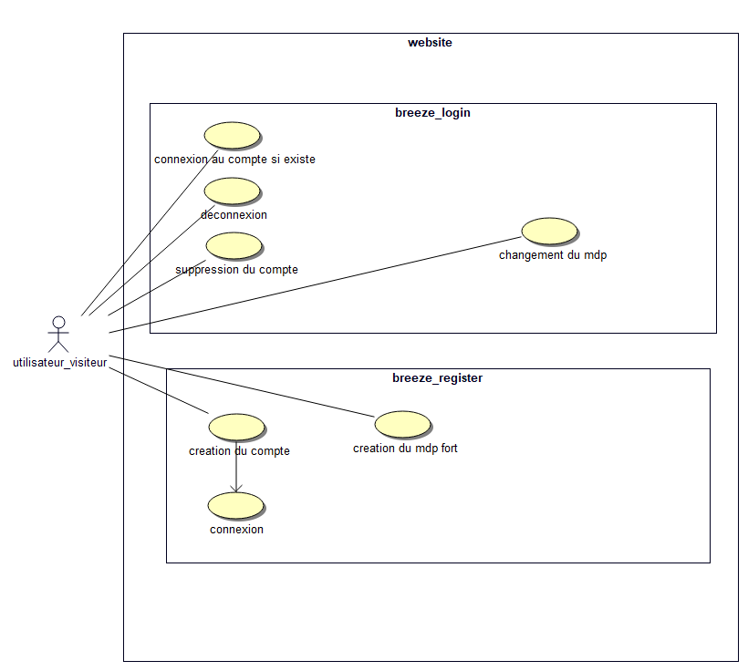
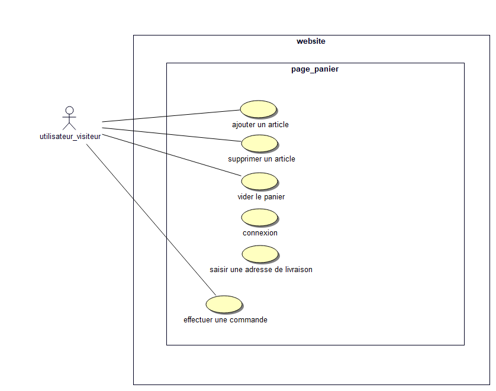

# Cahier des Charges : My Sneakers Shop

## 1. Introduction
**Objectif :** Création d'un site e-commerce dédié à la vente de chaussures, offrant une expérience utilisateur optimale pour la sélection et l'achat de produits.

## 2. Description du projet
**Nom du site :** My Sneakers Shop  
**Cible :** Amateurs de sneakers et grand public à la recherche de chaussures/sneakers en ligne.

## 3. Fonctionnalités du site

### 3.1 Gestion des utilisateurs
- **Inscription :** Création de compte.
- **Connexion :** Accès sécurisé au compte utilisateur.
- **Gestion du profil :** Modification des informations personnelles et du mot de passe.
- **Suppression de compte :** Option permettant à l'utilisateur de supprimer son compte.

### 3.2 Catalogue de produits
- **Affichage des produits :** Présentation claire des sneakers avec options de tri.
- **Fiche produit :** Détails du produit, choix de la pointure, et visualisation des photos.

### 3.3 Panier d'achat
- **Ajout au panier :** Sélection de la quantité et de la taille avant ajout au panier.
- **Modification du panier :** Mise à jour de la quantité et suppression d'articles du panier.
- **Validation de commande :** Le panier permet de passer la commande.

### 3.4 Processus de commande
- **Passage de commande :** Uniquement possible pour les utilisateurs connectés.

### 3.5 Service client
- **Formulaire de contact :** Pour les demandes d'informations ou autres.

## 4. Exigences techniques
- **Responsive Design :** Compatible avec tous les appareils (ordinateurs, tablettes, smartphones).
- **Sécurité :** Protection des données utilisateurs.
- **SEO :** Optimisation pour les moteurs de recherche (image pas trop lourdes l'or de l'affichage). 

## 5. Livrables
- **Bouml :** Schémas représentant la structure des pages principales.

 
 

- **Maquette :** Design visuel du site avant développement via figma logiciel de conception de maquette. 

[Voir le projet Figma](https://www.figma.com/proto/O37FCak21E8bfPKjWhnJYd/magazin?node-id=2697-833)

- **Documentation :** Guide d'utilisation notamment l'installation du projet.
[Doc](https://github.com/AdlenSouci/projet_sneakers-main/blob/main/README.md)
