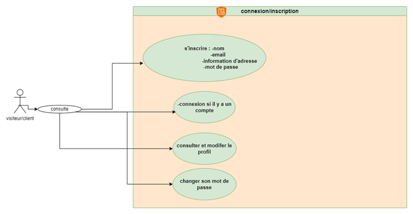

# Cahier des Charges : My Sneakers Shop

## 1. Introduction
**Objectif :** Création d'un site e-commerce dédié à la vente de chaussures, offrant une expérience utilisateur optimale pour la sélection et l'achat de produits.

## 2. Description du projet
**Nom du site :** My Sneakers Shop  
**Cible :** Amateurs de sneakers et grand public à la recherche de chaussures/sneakers en ligne.

## 3. Fonctionnalités du site

### 3.1 Gestion des utilisateurs
- **Inscription :** Création de compte avec mot de passe fort obligatoire.
- **Connexion :** Accès sécurisé au compte utilisateur via Laravel Breeze.
- **Gestion du profil :** Modification des informations personnelles et du mot de passe.
- **Suppression de compte :** Option permettant à l'utilisateur de supprimer son compte.

### 3.2 Pages du site
- **Accueil :** Page visuelle contenant un footer avec des informations commerciales.
- **Boutique :** Affichage des articles disponibles avec tri et filtres détaillés.
- **Page article :** Affichage détaillé de l'article avec description et état du stock.
- **A propos :** Historique et présentation de l'entreprise.
- **Contact :** Formulaire de contact pour les demandes d'informations.
- **Panier :** Consultation et gestion des articles ajoutés avant validation de commande.
- **Connexion :** Accès utilisateur avec inscription et connexion personnalisées.

### 3.3 Catalogue de produits
- **Affichage des produits :** Présentation claire des sneakers avec options de tri et de filtre.
- **Fiche produit :** Détails du produit, choix de la pointure, et visualisation des photos.
- **Ajout au panier :** Disponible uniquement après sélection d'une pointure. La quantité par défaut est 1 mais peut être modifiée.
- **Disponibilité des stocks :** Indication de l'état du stock et mise à jour automatique après achat.
- **Filtres de recherche avancés :**
  - Filtrer par marque.
  - Filtrer par couleur.
  - Trier les prix par ordre croissant ou décroissant.
  - Sélectionner une tranche de prix personnalisée.

### 3.4 Panier d'achat
- **Ajout et suppression d'articles :** Gestion du contenu du panier.
- **Modification du panier :** Mise à jour de la quantité et suppression d'articles sans rechargement de la page grâce à AJAX.
- **Vider le panier :** Option permettant de supprimer tous les articles en un clic.
- **Validation de commande :** Le panier permet de passer la commande.
- **Adresse de livraison :** Doit correspondre à celle saisie lors de la création du compte.

### 3.5 Processus de commande
- **Passage de commande :** Uniquement possible pour les utilisateurs connectés.
- **Mise à jour du stock :** Diminution automatique du stock lors d'un achat.
- **Confirmation de commande :** Envoi automatique d'un récapitulatif de commande par e-mail à l'administrateur et au client.

### 3.6 Service client
- **Formulaire de contact :** Fonctionnel avec envoi de mail.

## 4. Exigences techniques
- **Responsive Design :** Compatible avec tous les appareils (ordinateurs, tablettes, smartphones).
- **Sécurité :** Protection des données utilisateurs.
- **SEO :** Optimisation pour les moteurs de recherche (images optimisées pour l'affichage rapide).

## 5. Livrables

### Bouml
  
  
  

### Documentation
[Guide d'utilisation et installation du projet](https://github.com/AdlenSouci/projet_sneakers-main/blob/main/README.md)

### Auteur
**Adlen Souci**
